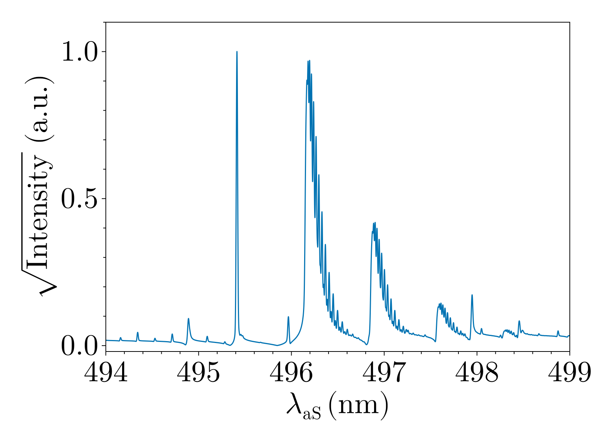

# NTECARS

[](https://christianabusch.github.io/NTECARS/dev/)

NTECARS is julia package for calculating and fitting dual-pump coherent anti-Stokes Raman scattering spectra under non-equilibrium conditions. A companion paper is currently being submitted. The code allows for a flexible modeling of the rovibrational distribution functions using either multi-temperature models or vibrational-distribution-free fitting. Convolutions with laser profiles and instrumental profiles are implemented.

## Installation
```julia
using Pkg
Pkg.add("https://github.com/ChristianABusch/NTECARS")
```

## Tutorials and Documentation
The latest tutorials and information are found in the [documentation](https://christianabusch.github.io/NTECARS/dev/)


## Example

```julia
using NTECARS

conditions = GasConditions(
    pressure = 15000.0, # in Pa
    T_gas    = 600.0    # in K
)

lasers = LaserConfiguration(
    wavelength_1 = 532e-9,  # First laser wavelength in nm 
    wavelength_2 = 561e-9,  # Second laser wavelength in nm
    stokes_range = (603e-9, 611e-9),
)

instrument = InstrumentConfiguration(
    profile = Gaussian(0.5/2.35)
)

N2_species = N2Species(
    molar_fraction = 0.9, 
    distribution = N2.MultiTemperatureDistribution(T_vib = 2200.0, T_rot = 600.0), 
)

CO2_species = CO2Species(
    molar_fraction = 0.1, 
    distribution = CO2.MultiTemperatureDistribution(T_12 = 600.0, T_3 = 1800.0, T_rot = 600.0),
    v_max = (0,1,1)
)

sim  = CARSSimulator(
    species    = [CO2_species, N2_species], 
    conditions = conditions, 
    lasers     = lasers, 
    instrument = instrument,
)

synthetic_spectrum = simulate_spectrum(sim)
```


Fitting is performed by defining a function that updates the parameters that should be fitted in the `CARSSimulator` struct. As an example, the molar fractions, rotational and vibrational temperatures can be fitted to the spectrum calculated above using
```julia
function update_function!(sim::CARSSimulator, param)
    T_12, T_3, T_N2vib, T_rot, CO2_frac = param
    # update translational temperature
    sim.conditions.T_gas = T_rot 
    # update CO2
    sim.species[1].molar_fraction = CO2_frac
    sim.species[1].distribution = CO2.MultiTemperatureDistribution(
        T_12 = T_12, T_3 = T_3, T_rot = T_rot)
    #update N2
    sim.species[2].molar_fraction = 1-CO2_frac
    sim.species[2].distribution = N2.MultiTemperatureDistribution(
        T_vib = T_N2vib, T_rot = T_rot)
end

result = fit_spectrum(;
    spec_exp     = synthetic_spectrum,
    sim          = sim, 
    initial      = [500.0, 500.0, 500.0, 500.0, 0.5], 
    lower        = [0.0, 0.0, 0.0, 0.0, 0.0],
    upper        = [3000.0, 3000.0, 3000.0, 3000.0, 1.0],
    parameter_update_function! = update_function!
)
```
```
julia> result.param
5-element Vector{Float64}:
  599.9951655653194
 1800.0074738526866
 2199.999957533644
  599.9996173555763
    0.09999943833785195
```
